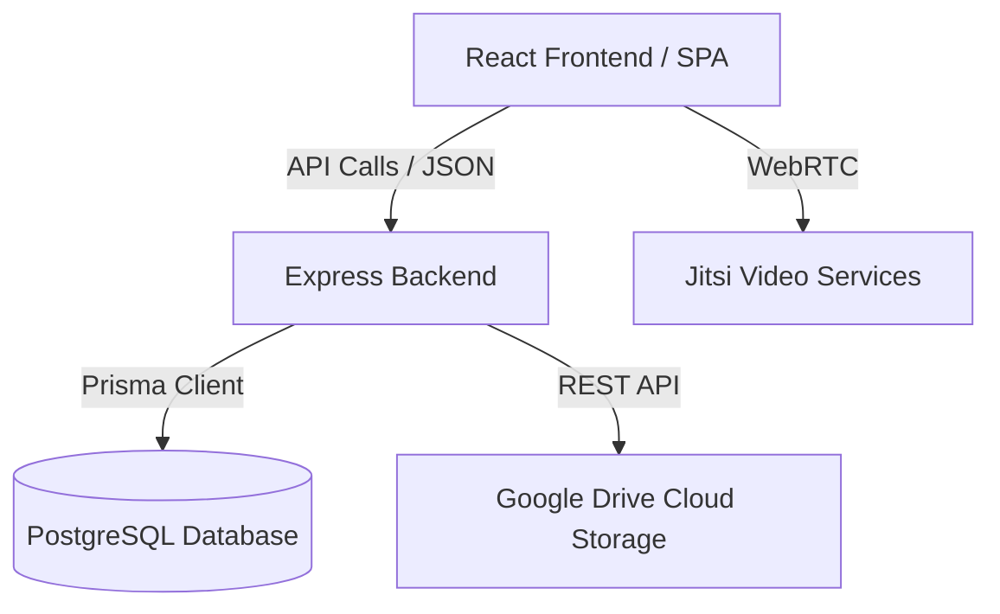

# Project Implementation Report — OpenLearnX LMS

OpenLearnX is a next-generation, open-source Learning Management System (LMS) designed to connect students, teachers, and administrators in a premium, role-based educational ecosystem.

---

## 1. Complete Project Overview
OpenLearnX provides an enterprise-grade SaaS virtual classroom and course management experience. The application features three distinct role portals (Admin, Teacher, Student) with visual components, custom analytics widgets, file streaming from Google Drive, and interactive WebRTC live lectures powered by Jitsi Meet.

---

## 2. Architecture Analysis
The project follows a decoupled **Client-Server** architecture.



### Backend (API Server)
- **Framework**: Express with TypeScript.
- **ORM**: Prisma Client.
- **Database**: PostgreSQL (relational storage).
- **Authentication**: JWT (Bearer tokens) and Google OAuth 2.0 (Passport session-sync).
- **Integrations**: Google Drive API for material uploads/streaming; Jitsi JaaS token generation for video classrooms.

### Frontend (Single Page Application)
- **Framework**: React 19 with Vite.
- **Styling**: TailwindCSS.
- **Animations**: Framer Motion.
- **State/Caching**: React Query (TanStack Query v5) and React Context.
- **Charts**: Recharts.

---

## 3. Folder Structure

### Backend Workspace
```
backend/
├── prisma/
│   ├── schema.prisma       # Prisma DB models & schema definitions
│   └── seed.ts             # Default admin and seed scripts
├── src/
│   ├── app.ts              # Express app setup and middleware
│   ├── index.ts            # Entrypoint (starts server on port 5000)
│   ├── config/             # Database client and global configs
│   ├── controllers/        # Route controllers containing business logic
│   ├── middleware/         # Auth guards, role checks, and upload handlers
│   ├── routes/             # Express sub-routers
│   ├── services/           # Service integrations (Drive, Email, Passport, Jitsi)
│   └── utils/              # Helper functions and utilities
└── swagger.yaml            # API Specification documentation
```

### Frontend Workspace
```
frontend/
├── src/
│   ├── App.tsx             # Main React entry & router configuration
│   ├── main.tsx            # DOM mounting script
│   ├── index.css           # Tailwind custom tokens & styles
│   ├── components/         # Reusable core elements (Card, Button, Badge, Modals)
│   ├── contexts/           # Auth and Theme provider states
│   ├── layouts/            # Collapsible navigation shells (Admin, Teacher, Student)
│   ├── pages/              # Portal page modules
│   │   ├── admin/          # User, course, and enrollment panels
│   │   ├── student/        # Continue learning, tasks, calendar
│   │   ├── teacher/        # Assignments, classes, student progress
│   │   └── shared/         # Course details and live video rooms
│   └── services/           # Axios interceptors & HTTP clients
```

---

## 4. Technology Stack
- **Languages**: TypeScript, JavaScript, SQL.
- **Server Framework**: Node.js, Express.
- **Database**: PostgreSQL.
- **Client Framework**: React 19, React Router v7.
- **Build Tools**: Vite, Esbuild, Rolldown.
- **Linter**: ESLint 10, TypeScript-ESLint.

---

## 5. Feature Implementation Status
| Module / Feature | Status | Implementation Details |
| :--- | :--- | :--- |
| **Google OAuth 2.0** | ✅ Implemented | Redirect strategy using Passport.js |
| **Local JWT Auth** | ✅ Implemented | Sign in with bcrypt password verification |
| **Role Dashboard** | ✅ Implemented | Clean layout variants for Admin, Teacher, and Student |
| **Live Lectures** | ✅ Implemented | WebRTC via Jitsi integration inside secure iframe |
| **Material Uploads** | ✅ Implemented | Streamed via backend Google Drive Media Proxy |
| **Email OTP** | ✅ Implemented | Mailer integrations for verify & reset tokens |

---

## 6. Module-Wise Analysis

### Shell Layouts
The layout wrappers (`AdminLayout`, `TeacherLayout`, `StudentLayout`) provide collapsible sidebars, breadcrumb trails, notification bells, mail indicators, moon/sun toggles, and detailed bottom profile sections showing department roles and active status.

### Student Portal
Offers the student quick access to Enrolled Courses, Completed Assignments, Quiz averages, and Badges. The "Continue Learning" carousel guides them back to pending courses, while the Calendar and Tasks lists monitor deadlines.

### Teacher Portal
Enables course curation, uploading PDFs/videos, checking attendance logs, reviewing assignments, and initiating live lectures.

### Admin Portal
Enables user account creation/editing, course validation, enrollment assignments, system log reports, and database status reviews.

---

## 7. API Analysis
All routes are prefixed with `/api` and registered under the main router:
- `/auth`: Handles local registration, login, refresh token, OTP validation, and Google OAuth redirects.
- `/users`: Performs CRUD operations on user metadata.
- `/courses`: Manages course modules, assignments, and study resources.
- `/enrollments`: Joins students to course catalogs.
- `/analytics`: Calculates metrics for KPI tiles and charts.
- `/media/drive/:fileId`: Proxies and pipes file streams directly from Google Drive.

---

## 8. Database Analysis
Prisma maps the relationships inside the database:
- **One-to-One**: `User` connects to at most one `Student` or `Teacher`.
- **One-to-Many**: `Course` relates to multiple `Lecture`s, `StudyMaterial`s, and `Assignment`s.
- **Many-to-Many**: `Student` is linked to `Course` through the `Enrollment` join model.

---

## 9. Authentication Flow
```
[Client Local Login] ──> Post Credentials ──> [Server Bcrypt Verification]
                                                      │
[Client Redirect Home] <── Bearer Tokens & Profile <──┘
```
1. Client submits email and password.
2. Server validates credentials against PostgreSQL and generates a short-lived Access Token + long-lived Refresh Token.
3. Client stores the access token in memory or LocalStorage, sending it in the `Authorization: Bearer <token>` header for subsequent requests via Axios interceptors.
4. If accessing via Google OAuth, the client is redirected to the Google Consent screen, completes authentication, and returns via a callback route which issues tokens and redirects to the dashboard.

---

## 10. Security Analysis
- **Password Safety**: Hashed using `bcrypt` before database storage.
- **Header Protection**: Implements `helmet` to manage browser HTTP headers, preventing clickjacking and mime sniffing.
- **Token Security**: Tokens are signed using a unique `JWT_SECRET`. Refresh tokens are validated and rotated regularly.
- **CORS**: Restricted origins configured to block unauthorized domains from querying endpoints.

---

## 11. Performance Analysis
- **Drive Caching**: Google Drive folder IDs are cached in the `GoogleDriveFolder` table to eliminate recursive folder queries.
- **Media Streaming**: The backend proxy uses `res.setHeader('Cache-Control', 'public, max-age=86400')` to cache assets for 24 hours.
- **Layout Animations**: Sidebars use GPU-accelerated `layoutId` animations in Framer Motion to prevent layout shift.

---

## 12. Error and Bug Report
- **State in Effect Warning**: Resolved synchronous state setters inside `useEffect` by utilizing `Promise.resolve().then(...)` to defer analytics loading.
- **Missing Lucide Icons**: Version compatibility issues with Lucide-react resolved by writing custom inline SVGs for SSO logos.

---

## 13. Missing Features
- **Payment Gateway**: Integration for premium course purchases (e.g. Stripe checkout).
- **Peer Chat**: Instant Messaging channels between teachers and students outside of live calls.
- **Quiz Engine**: Interactive multi-choice questions with automatic score submissions.

---

## 14. Recommendations
1. **SSO Cookies**: Switch OAuth credentials storage from LocalStorage to HTTPOnly Cookies to prevent XSS-based token theft.
2. **CDN Proxying**: Offload heavy static files and images to a dedicated Cloud CDN instead of routing them through the backend Node.js thread.
