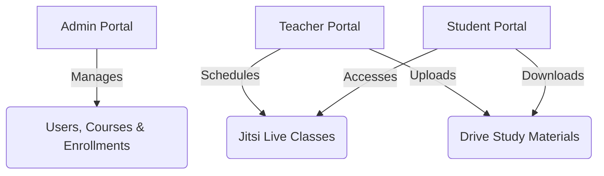

# 🎓 Smart LMS — Modern Learning Management System

<div align="center">

[](https://nodejs.org)
[](https://react.dev)
[](https://www.typescriptlang.org)
[](https://www.postgresql.org)
[](https://www.prisma.io)
[](https://tailwindcss.com)

**A high-performance, responsive virtual classroom platform designed for schools, colleges, coaching institutes, and independent online educators.**

[Explore Docs](./docs) • [Report Bug](https://github.com/rameshchavan07/smart-lms/issues) • [Request Feature](https://github.com/rameshchavan07/smart-lms/issues)

</div>

---

## 📖 Introduction

Smart LMS is a feature-rich virtual learning portal. It delivers **real-time classrooms**, **centralized document storage (Google Drive integration)**, **flexible user administration**, and **dynamic student dashboards** in a fast, beautiful interface. 

Built using a high-performance **Monorepo** structure, it combines a secure, strongly-typed **Express/TypeScript REST API** with a pixel-perfect, responsive **React 19/Tailwind CSS v4** single-page application.

---

## ⚡ Key Core Modules



### 👤 Role-Based Portals

*   🔑 **Admin Dashboard**
    *   **User Provisioning**: Full registration control over Student and Teacher profiles.
    *   **Active Audits**: Deactivate or reactivate user accounts instantly.
    *   **Course Cataloging**: Set up and update courses, assign primary instructors, and monitor enrollment count.
*   👨‍🏫 **Teacher Classroom**
    *   **Student Control**: Access rosters, enroll new students, and unenroll students for assigned courses.
    *   **Live Meet**: Schedule virtual lectures with automatic Jitsi Meeting ID generation.
    *   **Google Drive Vault**: Upload PDFs, DOCXs, PPTXs, and ZIP files directly to Google Drive.
*   🎓 **Student Workspace**
    *   **Live Stream**: Join scheduled lectures with an embedded, low-latency Jitsi video screen.
    *   **Classroom Materials**: View and download uploaded lecture resources instantly.

---

## 💻 Tech Stack & Architecture

### Frontend Application
*   **Engine**: React 19 (Vite bundler) + TypeScript
*   **Styling**: Tailwind CSS v4 + Lucide Icons + HSL tailored dark-mode pallets
*   **State Management**: React Context API (Auth status) + React Query (cache synchronization)
*   **Integrations**: Jitsi Meet React SDK for virtual classes

### Backend Services
*   **Engine**: Node.js + Express.js + TypeScript
*   **ORM**: Prisma Client v6
*   **Database**: PostgreSQL
*   **File Engine**: Google Drive API v3 (for secure, scalable cloud storage)
*   **Security**: JSON Web Tokens (JWT) + BCrypt password hashing + Route Guards

---

## 📂 Folder Layout

```text
smart-lms/
├── backend/                  # Node.js REST API
│   ├── prisma/               # Database Schema & Seed Engine
│   ├── src/
│   │   ├── controllers/      # API Controllers (Auth, Course, Lectures, Study Materials)
│   │   ├── middleware/       # Express Route Protections & Multer File parser
│   │   ├── routes/           # REST endpoints mapping
│   │   └── services/         # Integrations (Google Drive, Jitsi Meet tokens)
├── frontend/                 # React Single Page App
│   ├── src/
│   │   ├── components/       # Reusable UI widgets & Modals
│   │   ├── layouts/          # Workspace Frames (Admin, Teacher, Student)
│   │   └── pages/            # View dashboards and Classroom tabs
└── docs/                     # Full technical guidelines & roadmap status
```

---

## 🚀 Getting Started

### 📋 Prerequisites
*   Node.js (v18.0.0 or higher)
*   PostgreSQL running on `localhost:5432`

### 1. Database Configuration
Create a database named `smart_lms` in your PostgreSQL instance.

Create a `.env` file under `/backend` with the following configuration:
```env
PORT=5000
DATABASE_URL="postgresql://<username>:<password>@localhost:5432/smart_lms?schema=public"
JWT_SECRET="your_secret_jwt_key"
JWT_EXPIRES_IN="1d"

# Jitsi JaaS (Optional - falls back to free tier if omitted)
JITSI_APP_ID="your_jitsi_app_id"
JITSI_KID="your_jitsi_key_id"
JITSI_PRIVATE_KEY="your_jitsi_private_key"

# Google Drive Cloud Folder
GOOGLE_DRIVE_FOLDER_ID="your_google_drive_folder_id"
```

### 2. Apply Schema & Seed Accounts
Run the database migrations and populate the system with default test users:
```bash
cd backend
npx prisma migrate dev --name init
npx prisma db seed
```

> [!NOTE]
> For document uploads to function, place your Google Cloud Service Account JSON file named `credentials.json` directly inside the `/backend` folder.

### 3. Launch Development Servers

Start the **Backend API**:
```bash
cd backend
npm install
npm run dev
```
*(The API documentation will be available at [http://localhost:5000/api-docs](http://localhost:5000/api-docs))*

Start the **Frontend Client**:
```bash
cd ../frontend
npm install
npm run dev
```
*(Open [http://localhost:5173](http://localhost:5173) in your browser)*

---

## 🔐 Default Portals Access

Use these pre-configured user credentials to log in:

| Role | Username (Email) | Password | Portal View |
| :--- | :--- | :--- | :--- |
| **Admin** | `admin@smartlms.com` | `admin123` | Control center / Global logs |
| **Teacher** | `teacher@smartlms.com` | `teacher123` | Class manager / Material uploads |
| **Student** | `student@smartlms.com` | `student123` | Classroom view / Lecture streaming |

---

## 🛡️ Security Best Practices
*   **Password Security**: Hashed via BCrypt with salt rounds of 10.
*   **Auth Lifecycle**: Short-lived JWT Access Tokens combined with Database-backed Refresh Tokens.
*   **Permission Shields**: Middleware verification checking user roles on sensitive operations (Admin-only or Instructor-only).

---

## 📄 License
Distributed under the MIT License. See `LICENSE` for more information.
