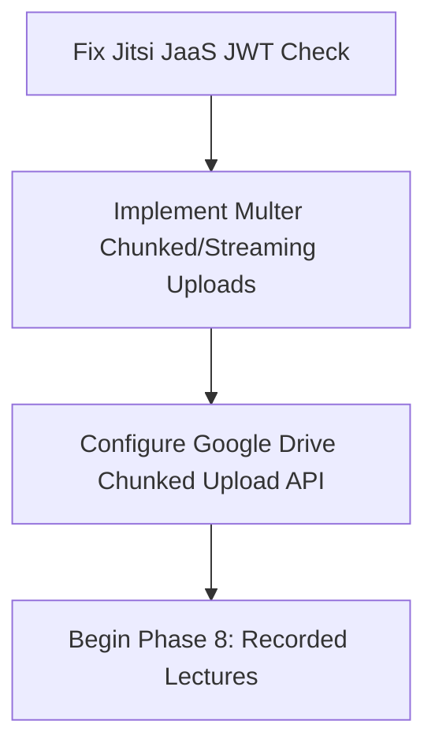

# Smart LMS - System Architecture & Codebase Analysis

This document provides a comprehensive review of the current **Smart LMS** implementation, with a focus on resolving Jitsi Meet issues, assessing security and code quality, identifying improvements for completed phases, and aligning prerequisites before initiating **Phase 8 (Recorded Lectures)**.

---

## 🔍 1. Jitsi Meet Integration Review

The virtual classroom is integrated using the Jitsi Meet React SDK in [LiveClassRoom.tsx](file:///d:/New%20folder/smart-lms/frontend/src/pages/shared/LiveClassRoom.tsx). However, there is a critical logical bug and a resulting security vulnerability in the configuration.

### 🚨 Critical Vulnerability: "First-to-Join Moderator" Risk
In `LiveClassRoom.tsx`, JaaS (Jitsi as a Service) is enabled using the following check:
```typescript
const isJaaS = !!import.meta.env.VITE_JITSI_APP_ID && !import.meta.env.VITE_JITSI_APP_ID.includes('vpaas-magic-cookie');
```
* **The Issue**: In development, the default Jitsi App ID is set to `vpaas-magic-cookie-cb79bc0f2c1d450f8054d9e0aceea812`. Because it contains `vpaas-magic-cookie`, the check evaluates to `false`.
* **The Consequence**: The system falls back to the public `meet.jit.si` domain and completely ignores the backend-generated JWT token.
* **The Risk**: On public `meet.jit.si` rooms, **moderator status is given to whoever enters the room first**. If a student joins the class link before the teacher, the student gains moderator rights and can mute the teacher, kick other students, or lock the room.

### 🔒 JWT Token Scope
In [jitsi.service.ts](file:///d:/New%20folder/smart-lms/backend/src/services/jitsi.service.ts), the room authorization payload is set to:
```javascript
room: '*',
```
This grants access to any room using the signed JWT. For higher security, this should be restricted to the specific room name requested:
```javascript
room: roomName,
```

---

## 🛡️ 2. Security & Performance Observations

### 1. Orphaned Refresh Tokens (No Logout Endpoint)
* **Observation**: In [authController.ts](file:///d:/New%20folder/smart-lms/backend/src/controllers/authController.ts), refresh tokens are saved in the PostgreSQL `RefreshToken` table upon login. However, there is **no logout endpoint** in the backend. 
* **Impact**: The frontend simply deletes the tokens from local storage, leaving active refresh tokens in the database. This causes database table bloating and leaves a security vulnerability where a hijacked refresh token remains valid for 7 days with no way for a user to invalidate it.

### 2. Lack of Request Validation Layer
* **Observation**: Backend controllers process inputs from `req.body` directly without any validation (e.g., email format validation, password complexity constraints, checking integer ranges).
* **Impact**: Vulnerable to malformed requests, which can lead to unhandled runtime exceptions or database crashes.

### 3. Database Overhead in Authentication Middleware
* **Observation**: The `protect` middleware in [auth.ts](file:///d:/New%20folder/smart-lms/backend/src/middleware/auth.ts) queries the database (`prisma.user.findUnique`) on **every single request** to check if the user is active.
* **Impact**: While secure, it adds database read latency to every guard-protected endpoint.

---

## 🛠️ 3. Suggested Improvements for Previous Phases

### Phase 1: Authentication System
* **Logout Endpoint**: Add `POST /api/auth/logout` that deletes the active `RefreshToken` from the database.
* **Input Validation**: Add `express-validator` or `zod` to validate authorization inputs.

### Phase 2: User Management
* **Admin Actions**: Implement backend endpoints and frontend modals for editing user profiles and deleting accounts.

### Phase 3: Course Management
* **Course Thumbnails**: Add support for uploading course thumbnails. Now that Google Drive OAuth2 uploads are fully working, we can easily reuse `uploadFileToDrive` to upload course thumbnail files to a dedicated `courses/thumbnails` directory.

### Phase 5: Dashboard Development
* **Audit Logs**: Connect the existing `AuditLog` database model to render a "Recent Activities Feed" on the Admin and Teacher dashboards.

---

## 📈 4. Recommendations Before Starting Phase 8 (Recorded Lectures)

Recorded Lectures involve uploading large video files (up to 2GB) to Google Drive. We must address these prerequisites:



1. **Multer Memory Restrictions**: Standard Multer configuration loads files into temporary buffers or writes them synchronously. A 2GB file will crash the server with an `Out of Memory` exception. We must implement **chunked uploads** or **direct stream piping** for video files.
2. **Jitsi Iframe Event Hooks**: In `LiveClassRoom.tsx`, we should hook into `participantJoined` and `participantLeft` events to log attendance logs (Phase 9) locally before students leave.

---

## 📅 5. Priority-wise Action Items

| Priority | Task Description | Target File(s) | Status |
| :---: | :--- | :--- | :---: |
| **P0** | **Fix Jitsi JaaS Sandbox Bypass**: Enable JWT & JaaS moderator controls by default | [LiveClassRoom.tsx](file:///d:/New%20folder/smart-lms/frontend/src/pages/shared/LiveClassRoom.tsx) | 🔴 Pending |
| **P0** | **JWT Room Security**: Restrict Jitsi JWT payloads to specific room names | [jitsi.service.ts](file:///d:/New%20folder/smart-lms/backend/src/services/jitsi.service.ts) | 🔴 Pending |
| **P0** | **Logout Endpoint**: Add endpoint to delete refresh tokens on user logout | [authController.ts](file:///d:/New%20folder/smart-lms/backend/src/controllers/authController.ts) / [authRoutes.ts](file:///d:/New%20folder/smart-lms/backend/src/routes/authRoutes.ts) | 🔴 Pending |
| **P1** | **Course Thumbnail Upload**: Implement thumbnail uploads using Google Drive | Course Controller & Frontend UI | 🔴 Pending |
| **P1** | **Input Validation Guard**: Integrate validation layer for authentication inputs | [authController.ts](file:///d:/New%20folder/smart-lms/backend/src/controllers/authController.ts) | 🔴 Pending |
| **P2** | **Admin Edit/Delete Users**: Complete missing CRUD actions for user management | User Controller & Frontend UI | 🔴 Pending |
| **P2** | **Audit Log Feed**: Populate recent activity logs on dashboards | Dashboard Views | 🔴 Pending |
